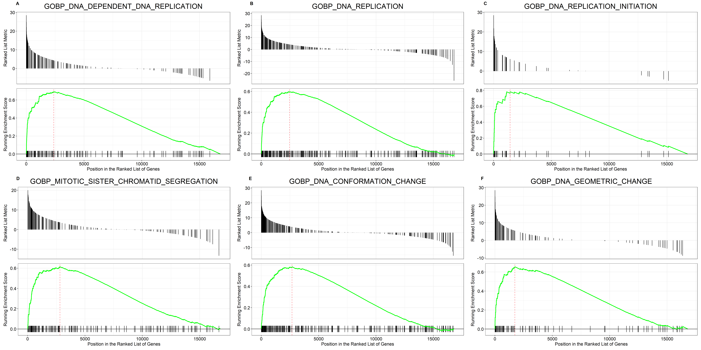
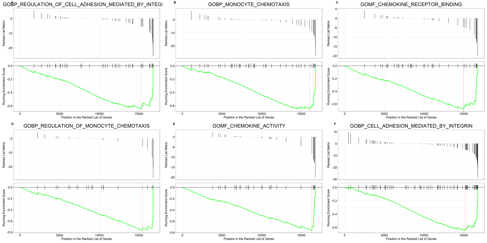

```{r setup, include=FALSE}
knitr::opts_chunk$set(echo = TRUE,
                      message=FALSE,warning=FALSE)
#load libraries
library(tximport)
library(DESeq2)
library(EnsDb.Hsapiens.v86)
library(tidyverse)
library(dplyr)
library(EnhancedVolcano)
library(GEOquery)
library(msigdbr)
library(clusterProfiler)
library(ggpubr)
library(pheatmap)
library(DT)
```

## Introduction

This analysis investigates the trancriptomic changes in lung adenocarcinoma cells after infection with SAR-CoV-2, providing insights into the potential impact of the virus on cancer cells. With ongoing COVID-19 pandemic, it is important to understand how the virus may affects lung cancer cells. By analyzing the gene expression changes in cancer lung adenocarcinoma cells (A549 Cell line) following SARS-CoV-2 infection, this analysis aims to provide insight into the molecular mechanisms underlying the interaction between the virus and host cell (A549).


## Get Data
For this analysis, The data was sourced from the GEO database (accession ID: GSE147507). The analysis considered only the samples from Series 5, Consisting of Three mock treated A549 samples and 3 SARS-CoV-2 infected (MOI 2) samples.

```{r}
gse <- getGEO(GEO = "GSE147507", GSEMatrix = TRUE)
metadata <- pData(phenoData(gse[[1]]))

count_data <- read.delim("GSE147507_RawReadCounts_Human.tsv/GSE147507_RawReadCounts_Human.tsv", 
                         sep = "\t", header = TRUE, row.names = 1)
#generate a coldata
colData <- metadata %>%
  dplyr::filter(grepl("Series5",title))%>%
  dplyr::select(1,2,8,10,11,13)%>%
  dplyr::mutate(condition= factor(rep(c("control","infected"), each = 3), levels = c("control", "infected")))

#select only select  samples
count_data <- count_data %>%
  dplyr::select(contains("Series5_A549_Mock") | contains("Series5_A549_SARS.CoV.2"))
#rename columns
colnames(count_data) <- colData$geo_accession
```

## Create a DESeq Dataset
DESeq2 is used to import the count data, contrasting the two different conditions. PCAplot is generated to check the variability between the two condtions, i.e, infected and mock infected.
The variability between the infected samples and controls is explained by largely by PC1, 

```{r}
dds <- DESeqDataSetFromMatrix(countData = count_data,
                              colData = colData,
                              design = ~condition) 
vst <- vst(dds)
plotPCA(vst, intgroup = c("condition"))+
  theme_bw()+
  ggtitle("Variability between Controls and Infected Samples")
```

## Run DESeq2
The Differential gene expression analysis between A549 and Control samples was performed using DESeq, resulting in the generation of an MA plot as depicted below. This method allowed for an assessment of gene expression differences between the two samples.
```{r}
#run DESeq
dds <- DESeq(dds)

#get results
res <- results(dds, contrast = c("condition", "control","infected"))

summary(res)
```
## DESeq Result Table
The MA plot, which displays the log2 fold changes on the y-axis and the mean of normalized counts on the x-axis, presents the results of applying the lfcShrink function to visualize differential gene expression in the A549 and Control cell lines after infection with SARS-CoV-2. This plot effectively highlights the genes that show altered expression in the two cell lines. 

```{r}
resNorm <- lfcShrink(dds = dds, res = res, type = "normal", coef = 2)

plotMA(resNorm)

# Make a DF
resdf <- as.data.frame(resNorm)%>%
  dplyr::arrange(padj)
datatable(resdf, options = list(pageLength = 10, scrollX = "400px"))
```

## Volcanoplot
The volcano plot was generated to clearly demonstrate the differentially expressed genes between the two conditions, providing a visual representation of gene expression changes.
```{r, fig.width= 10}
resdf <- resdf %>%
  rownames_to_column()%>%
  dplyr::rename("Symbol" = "rowname")

#plot volcanoplot
EnhancedVolcano(resdf, lab = resdf$Symbol, FCcutoff = 2, pCutoff = 0.05, x = "log2FoldChange", y = "padj", title = "Differential Gene Expression", subtitle = "Down and Up Expressed genes in SARS-CoV-2 infected A549 Cell line")
```

## Heatmap
The heat map presents the 10 top expressed and down-regulated genes between the two groups of samples, offering a clear visual representation of gene expression differences.
```{r}
#get overexpressed genes
over_expressed <- resdf %>% 
  dplyr::filter(padj < 0.05 & log2FoldChange > 2) %>%
  dplyr::arrange(padj)
#get under expressed genes
under_expressed <- resdf %>% 
  dplyr::filter(padj < 0.05 & log2FoldChange < -2) %>%
  dplyr::arrange(padj)
  
top_10 <- rbind(head(over_expressed,10), head(under_expressed,10))
#plot heatmap
vst_mat <-assay(vst)
deg_hm <- vst_mat[top_10$Symbol,]
pheatmap(deg_hm, fontsize_row=14, scale='row')
```

## Geneset enrichment analysis (GSEA)
A Gene set enrichment analysis was carried out using the stat column as the ranking metric, and the ontology gene set (Category C5) from MSigDB was utilized to identify enriched biological pathways and processes. This approach allowed for a deeper understanding of the functional implications of the differentially expressed genes as result of infection in lung Adenocarcinoma.

```{r}
gene_sets <- msigdbr(species = "Homo sapiens", category = "C5")
gene_sets <- gene_sets %>%
  dplyr::select(gs_name, gene_symbol)


#create a genelist, ranked using stat
geneList <- resdf%>%
  dplyr::select(Symbol, stat)%>%
  distinct(Symbol, .keep_all = TRUE)%>%
  filter(! is.na(stat)) %>%
  dplyr::arrange(desc(stat))%>%
  dplyr::filter(!is.na(stat))%>%
  deframe()
```
## Run GSEA

```{r}
# Run GSEA
gseares <- GSEA(geneList = geneList, 
                TERM2GENE = gene_sets)
gsearesdf <- as.data.frame(gseares)%>%arrange(desc(NES))%>%
  dplyr::select(-c(2))
datatable(gsearesdf, options = list(pageLength = 10, scrollX = "400px"), rownames = FALSE)
```

## GSEA plots
These plots show the top six upregulated and downregulated genesets.
```{r}
# extract the top 6 over-expressed geneset IDs
top_pathways <- gsearesdf %>%
  top_n(n = 6, wt = NES) %>%
  pull(ID)

# Make gseaplot for each and return as list
top_pathway_plots <- lapply(top_pathways, function(pathway) {
  gseaplot(gseares, geneSetID = pathway, title = pathway)
})
# Arrange with labels as a multi-panel plot
top_pathway_plot <- ggarrange(plotlist = top_pathway_plots,
                              ncol = 3, nrow = 2, labels = "AUTO",hjust = -5)
# Save it
ggsave(top_pathway_plot, filename = "Control_vs_A549_top_GSEA.png",
       height = 15, width = 30)
```

```{r}
# Repeat steps with top 4 under-expressed pathways
bottom_pathways <- gsearesdf %>%
  top_n(n = 6, wt = -NES) %>%
  pull(ID)
bottom_pathway_plots <- lapply(bottom_pathways, function(pathway) {
  gseaplot(gseares, geneSetID = pathway, title = pathway)
})
bottom_pathway_plot <- ggarrange(plotlist = bottom_pathway_plots,
                                 ncol = 3, nrow = 2, labels = "AUTO",hjust = -5)
ggsave(bottom_pathway_plot, filename = "Control_vs_A549_down_GSEA.png",
       height = 15, width = 30)
```


## Biological interpretation
The finding of this analysis indicate that there is high replication of DNA, which is expected as the virus makes more copies. this is indicated by a set of genes involved in the biological process "GOBP_DNA_DEPENDENT_DNA_REPLICATION" being upregulated. 

It is also noted from the results that the virus affects the immune response to infection. Genes involved in Molecular functions and biological process such as such as "GOMF_COLLAGEN_BINDING" and "GOBP_CELL_ADHESION_MEDIATED_BY_INTEGRIN" are among the most down regulated genes. This indicates a reduction in cell adhesion, chemotaxis, and the binding of chemokines, which are crucial in the immune response to infections. This may imply that the virus could be suppressing the host immune response and promoting its own replication.

In summary, the perturbation of A549 cell line with SARS-CoV-2 brings about changes in the cellular environment that promotes the virus replication and suppression of immune responses. further studies are needed to confirm these observations in order to fully understand the impact of the virus on A549 cell line.