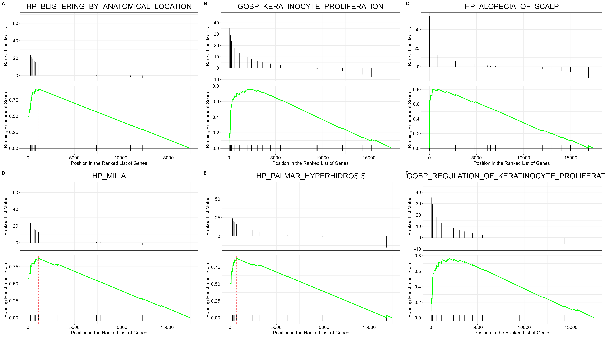
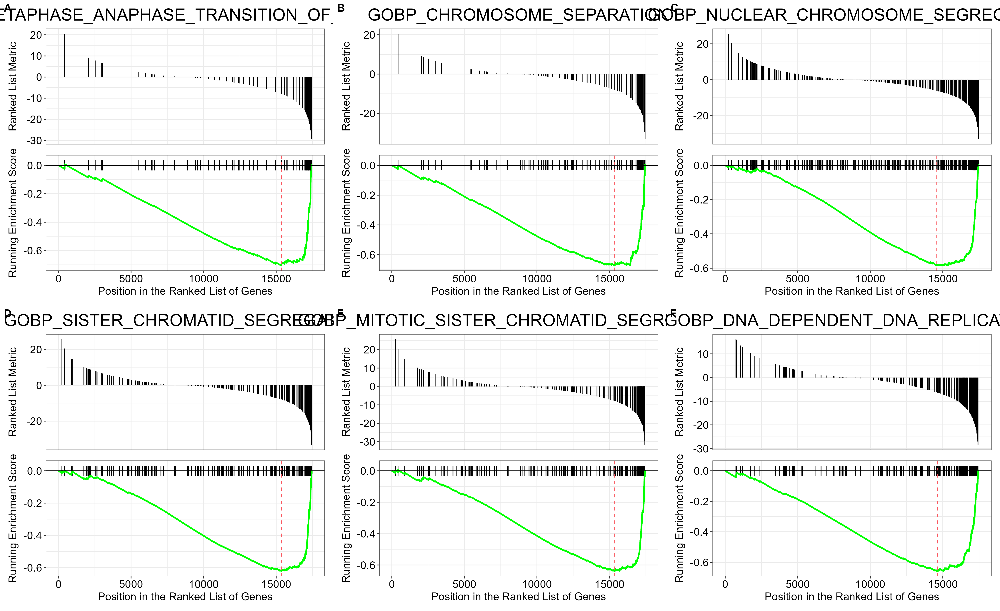

```{r setup, include=FALSE}
knitr::opts_chunk$set(echo = TRUE)
#load libraries
library(tximport)
library(DESeq2)
library(EnsDb.Hsapiens.v86)
library(tidyverse)
library(dplyr)
library(EnhancedVolcano)
library(GEOquery)
library(msigdbr)
library(clusterProfiler)
library(ggpubr)
library(pheatmap)
library(DT)
```

## 1. Introduction

SARS-CoV-2 is a single-stranded positive-sense RNA virus that affects humans.  
This is a comparison analysis of A549 cell line trancriptome to the NHBE after infection with the SARS-CoV-2 virus. 
How does SARS-CoV-2 affect A549 (Lung adenocarcinoma) cell line and NHBE cell line (primary human bronchial epithelial cells).


## Get Data
The data for this analysis came from GEO, submission ID GSE147507. 
from this, only samples from series one and two, excluding the mock treated samples, have been utilized.

```{r, message=FALSE,warning=FALSE}
gse <- getGEO(GEO = "GSE147507", GSEMatrix = TRUE)
metadata <- pData(phenoData(gse[[1]]))

count_data <- read.delim("GSE147507_RawReadCounts_Human.tsv/GSE147507_RawReadCounts_Human.tsv", 
                         sep = "\t", header = TRUE, row.names = 1)
#generate a coldata
colData <- metadata%>%
  dplyr::select(1,2,8,10,11,13)%>%
  dplyr::filter(geo_accession %in% c("GSM4432381","GSM4432382","GSM4432383","GSM4432387","GSM4432388","GSM4432389"))%>%
  dplyr::mutate(cell_type= gsub("cell line: ","", characteristics_ch1 ))

#select only select  samples
count_data <- count_data %>%
  dplyr::select(contains("Series1_NHBE_SARS.CoV.2") | contains("Series2_A549_SARS.CoV.2"))
#rename columns
colnames(count_data) <- colData$geo_accession
```

## Create a DESeq Dataset
DESeq2 is used to import the count data, contrasting the two different cell types. PCAplot is generated to check the variability between the two cell lines.
The variability between the two cell lines is explained by PC1

```{r}
dds <- DESeqDataSetFromMatrix(countData = count_data,
                              colData = colData,
                              design = ~cell_type) 
vst <- vst(dds)
plotPCA(vst, intgroup = c("cell_type")) +
  ylim(-24, 24) +
  theme_bw()
```
## Run DESeq2
To perform Differential gene expression analysis between NHBE and A549 samples, DESeq function was applied. enabling the generation of the MA plot as shown below. 
```{r}
#run DESeq
dds <- DESeq(dds)

#get results
res <- results(dds, contrast = c("cell_type", "NHBE","A549"))

summary(res)
plotMA(res)
```
## DESeq Result Table
The MA plot, a plot of log2 fold changes(on the y-axis) versus the mean of normalised counts (on the x-axis), after applying the lfcShrink function, shows differently expressed genes in the two cell lines after infection with SARZ-CoV-2. 

```{r}
resNorm <- lfcShrink(dds = dds, res = res, type = "normal", coef = 2)

plotMA(resNorm)

# Make a DF
resdf <- as.data.frame(resNorm)
datatable(resdf, options = list(pageLength = 10, scrollX = "400px"))
```

## Volcanoplot
The volcano plot is here drawn to show differentialy expressed genes in the two cell types.
```{r}
resdf <- resdf %>%
  rownames_to_column()%>%
  dplyr::rename("Symbol" = "rowname")

#plot volcanoplot
EnhancedVolcano(resdf, lab = resdf$Symbol, FCcutoff = 2, pCutoff = 0.01, x = "log2FoldChange", y = "padj")
```

## Heatmap
This Heat map, shows the top expressed and down expressed genes between the two cell lines.
```{r}
#get overexpressed genes
over_expressed <- resdf %>% 
  dplyr::filter(padj < 0.01 & log2FoldChange > 2) %>%
  dplyr::arrange(padj)
#get under expressed genes
under_expressed <- resdf %>% 
  dplyr::filter(padj < 0.01 & log2FoldChange < -2) %>%
  dplyr::arrange(padj)
  
top_10 <- rbind(head(over_expressed,10), head(under_expressed,10))
#plot heatmap
vst_mat <-assay(vst)
deg_hm <- vst_mat[top_10$Symbol,]
pheatmap(deg_hm, fontsize_row=14, scale='row')
```

## Geneset enrichment analysis (GSEA)
Gene set enrichment analysis was performed by ranking the genes using the stat column as the ranking metric. ontology gene set (Category C5) from msigdb was used.

```{r}
gene_sets <- msigdbr(species = "Homo sapiens", category = "C5")
gene_sets <- gene_sets %>%
  dplyr::select(gs_name, gene_symbol)


#create a genelist, ranked using stat
geneList <- resdf%>%
  dplyr::select(Symbol, stat)%>%
  distinct(Symbol, .keep_all = TRUE)%>%
  filter(! is.na(stat)) %>%
  dplyr::arrange(desc(stat))%>%
  dplyr::filter(!is.na(stat))%>%
  deframe()
```
## Run GSEA

```{r}
# GSEA value histogram
hist(geneList, breaks = 100)

# Run GSEA
gseares <- GSEA(geneList = geneList, 
                TERM2GENE = gene_sets)
gsearesdf <- as.data.frame(gseares)%>%arrange(desc(NES))
datatable(gsearesdf, options = list(pageLength = 10, scrollX = "400px"))
```

## Make GSEA plot for top expressed genesets
compiling the top and Down expressed genesets. from the results, Half of the top 6 gene sets enriched, are those involved in keratinocytes proliferation and epidermis development. 

SAR-CoV-2 infection of A529, leads to down expression of genes that are involved in cell proliferation.
```{r}

# extract the top 6 over-expressed geneset IDs
top_pathways <- gsearesdf %>%
  top_n(n = 6, wt = NES) %>%
  pull(ID)

# Make gseaplot for each and return as list
top_pathway_plots <- lapply(top_pathways, function(pathway) {
  gseaplot(gseares, geneSetID = pathway, title = pathway)
})
# Arrange with labels as a multi-panel plot
top_pathway_plot <- ggarrange(plotlist = top_pathway_plots,
                              ncol = 3, nrow = 2, labels = "AUTO")
# Save it
ggsave(top_pathway_plot, filename = "NHBE_vs_A549_top_GSEA_up.png",
       height = 14, width = 25)
```

```{r}
# Repeat steps with top 4 under-expressed pathways
bottom_pathways <- gsearesdf %>%
  top_n(n = 6, wt = -NES) %>%
  pull(ID)
bottom_pathway_plots <- lapply(bottom_pathways, function(pathway) {
  gseaplot(gseares, geneSetID = pathway, title = pathway)
})
bottom_pathway_plot <- ggarrange(plotlist = bottom_pathway_plots,
                                 ncol = 3, nrow = 2, labels = "AUTO")
ggsave(bottom_pathway_plot, filename = "NHBE_vs_A549_top_GSEA_down.png",
       height = 11, width = 18)
```


## Biological interpretation
Looking at the results of GSEA, the genesets that are involved in cell division are down expressed in A549 cell line. Cancer cells are characterized by increased proliferation, but this analysis proves otherwise. 
Future studies should study transcriptomes of different cancerous cell lines infected with SARS-CoV-2 to check how the virus affects cell proliferation.